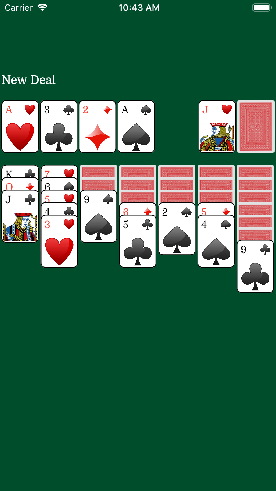

# Solitaire

Solitaire is a Flutter implementation of the card game.  Mostly the same rules as I remember from Microsoft's version.

|

## License

Solitaire is licensed under the MIT License. See the LICENSE file for more information, but basically this is sample code and you can do whatever you want with it.